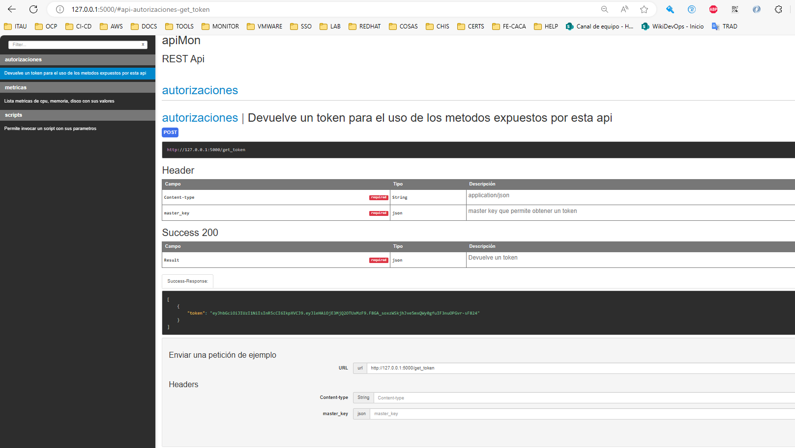

# API_MON

## Informacion

API para obtener metricas de uso de cpu, memoriua y disco del equipo donde se ejecuta. Tambien puede ejecutar un script, el cual mediante parametros determina el tipo de ejecucion.

```json
{
    "cpu_percent": 0.1,
    "disk_usage": {
        "free": 946.0691909790039,
        "percent": 1,
        "total": 1006.853931427002,
        "used": 9.56911849975586
    },
    "load_avg": {
        "15m": 0,
        "1m": 0,
        "5m": 0
    },
    "memory_usage": {
        "available": 6641.09375,
        "free": 5429.765625,
        "percent": 14.3,
        "total": 7748.07421875,
        "used": 855.06640625
    },
    "network_usage": {
        "bytes_recv": 13549,
        "bytes_sent": 9744
    }
}
```

## Lenguaje y frameworks utilizados

### Lenguaje

[python 3.9](https://www.python.org/)

### Framework

[Flask](https://flask.palletsprojects.com/en/3.0.x/)

### Documentacion API

[apiDocjs](https://apidocjs.com/)

## Funciones y programas

- check_and_download:
    Este metodo valida que el script.sh, almacenado en este caso en S3 (aws), esté actualizado y en caso de haber cambios lo descarga y remplaza el actual. La intención es mantener actualizado el script de multiples instancias para evitar re-construir la imagen con cada cambio de script. 
    El log queda en /var/log/crond.log:

    ```log
        Script descargado exitosamente desde https://eval-s3-py-script.s3.amazonaws.com/script.sh
        Script actualizado el 2024-08-26 21:15:01
        Script descargado exitosamente desde https://eval-s3-py-script.s3.amazonaws.com/script.sh
        No hay nueva versión del script disponible.
        Script descargado exitosamente desde https://eval-s3-py-script.s3.amazonaws.com/script.sh
        No hay nueva versión del script disponible.
    ```

- main:
    Es la funcion principal de la API, la cual tiene una seria de funciones para generar un otken, listar metricas, ejecutar un script

## Actualizacion de la documentacion (apidocjs)

**Instalacion de apidoc:**

```bash
npm install -g apidoc
```

**Generacion de documentacion:**

Posicionado en la raiz del proyecto (api), ejecutar

```bash
apidoc -i ./ -o ./
```

***Esto generará la documentacion de la api dentro de la carpeta app***

**Acceso a la documentacion:**

La documentacion es accesible desde el root de la URL http:xxx:5000/



## Construccion de imagen

```bash
docker build api/ -t IMAGEN:TAG --build-arg port=5000
```

## Ejecucio de la imagen

```bash
docker run -d -p HOST_PORT:CONTAINER_PORT IMAGEN:TAG
```

## Obtencion de token

Existe un metodo de obtencion de un token para poder consumir los metodos, el modo de uso es el siguiente mediante una clave maestra. Este token durará 5 minutos (segun la definicion en el dockerfile)

```powershell
    #WINDOWS
    Remove-Item Env:http_proxy #Si aplica remover los proxies
    Remove-Item Env:https_proxy #Si aplica remover los proxies
    curl -X POST -H "Content-Type: application/json" -d '{"master_key": ""}' http://127.0.0.1:5000/get_token
```

```bash
    #LINUX
    export http_proxy="" #Si aplica remover los proxies
    export https_proxy="" #Si aplica remover los proxies
    curl -X POST -H "Content-Type: application/json" -d '{"master_key": ""}' http://127.0.0.1:5000/get_token
```

## Uso de metrics

```powershell
    #WINDOWS
    Remove-Item Env:http_proxy #Si aplica remover los proxies
    Remove-Item Env:https_proxy #Si aplica remover los proxies
    curl -H "Authorization: <token>" http://localhost:5000/metrics
```

```bash
    #LINUX
    export http_proxy="" #Si aplica remover los proxies
    export https_proxy="" #Si aplica remover los proxies
    curl -H "Authorization: <token>" http://localhost:5000/metrics
```

## Uso de run_script

### Listar procesos por uso de memoria

```powershell
    #WINDOWS
    Remove-Item Env:http_proxy #Si aplica remover los proxies
    Remove-Item Env:https_proxy #Si aplica remover los proxies
    curl -X POST -H "Content-Type: application/json" -H "Authorization: <token>" -d '{"option": "mem"}' http://127.0.0.1:5000/run_script
```

```bash
    #LINUX
    export http_proxy="" #Si aplica remover los proxies
    export https_proxy="" #Si aplica remover los proxies
    curl -X POST -H "Content-Type: application/json" -H "Authorization: <token>" -d '{"option": "mem"}' http://127.0.0.1:5000/run_script
```

### Listar uso de disco por carpetas

```powershell
    #WINDOWS
    Remove-Item Env:http_proxy #Si aplica remover los proxies
    Remove-Item Env:https_proxy #Si aplica remover los proxies
    curl -X POST -H "Content-Type: application/json" -H "Authorization: <token>" -d '{"option": "disk", "directory": "/"}' http://127.0.0.1:5000/run_script
```

```bash
    #LINUX
    export http_proxy="" #Si aplica remover los proxies
    export https_proxy="" #Si aplica remover los proxies
    curl -X POST -H "Content-Type: application/json" -H "Authorization: <token>" -d '{"option": "disk", "directory": "/"}' http://127.0.0.1:5000/run_script
```

### Listar procesos por uso de cpu

```powershell
    #WINDOWS
    Remove-Item Env:http_proxy #Si aplica remover los proxies
    Remove-Item Env:https_proxy #Si aplica remover los proxies
    curl -X POST -H "Content-Type: application/json" -H "Authorization: <token>" -d '{"option": "cpu"}' http://127.0.0.1:5000/run_script
```

```bash
    #LINUX
    export http_proxy="" #Si aplica remover los proxies
    export https_proxy="" #Si aplica remover los proxies
    curl -X POST -H "Content-Type: application/json" -H "Authorization: <token>" -d '{"option": "cpu"}' http://127.0.0.1:5000/run_script
```
